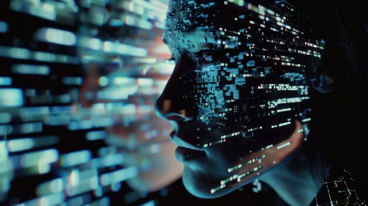

# Introduction

{width=50%}

&nbsp;&nbsp;&nbsp;&nbsp;The age of technology has broadened the horizons of human capabilities in so many exciting ways. These advancements have allowed for exponential improvements in medicine, science, and access to information. Additionally, technology serves as an excellent outlet for creativity and social connection. Rapid innovation in technology is still ongoing and will continue to change our reality.

&nbsp;&nbsp;&nbsp;&nbsp; While the revolution of technology holds so much promise, the dangers of technology must be addressed so that technology is part of creating a better future rather than destroying it. A key risk of technology resides in the internet. The internet itself can be a useful tool, but normalized internet behavior is becoming a threat to human health and the environment. People aged between 16-64 spent an average of 6 hours and forty minutes on the internet in 2023 and numbers are similar across recent years (Kemp, 2024). So, it's clear that the internet is an integral part of life no matter the age. This means the internet itself holds weight in shaping our individual identities as well as our global identity. Internet addiction causes us to lose focus on the beauty in our lives, and in this tangle we can lose our own individuality.

&nbsp;&nbsp;&nbsp;&nbsp; As the internet feeds on our mental and physical health, division is spurred on the global level. Access to the internet, the internet spaces that we operate in, and propaganda on the internet are all sources of this division. Therefore, the global identity of people, whose experiences are different but uniquely human, is lost. Not only is our figurative identity being shaped by technology, but Earth, our home and symbol of our physical identity, is being destroyed.

&nbsp;&nbsp;&nbsp;&nbsp; This issue is certainly at a pinnacle in which the choice for change or continuing on as is must be made now. And the importance of this point in time is understood by the UN who have created Sustainable Development Goals(SDGs) which were designed to ensure a safe, healthier, and more sustainable future worldwide. One of the SDGs (Good Health and Well-Being) outlines sub-targets to improve global physical and mental health which can be affected by bad internet habits. Further, reducing the environmental impacts of the internet could play a key part in SDG #12 (Responsible Consumption and Production) and SDG #13 (Climate Action). International cooperation through the SDGs is imperative for working towards a society that is beneficial for everyone which can be sparked through individual changes. 

