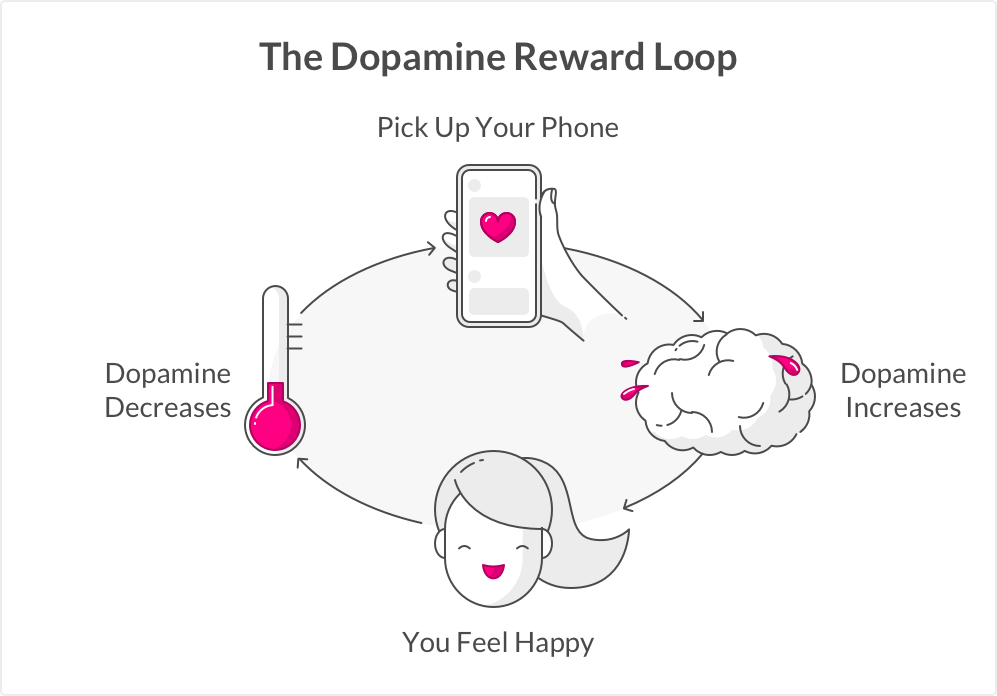
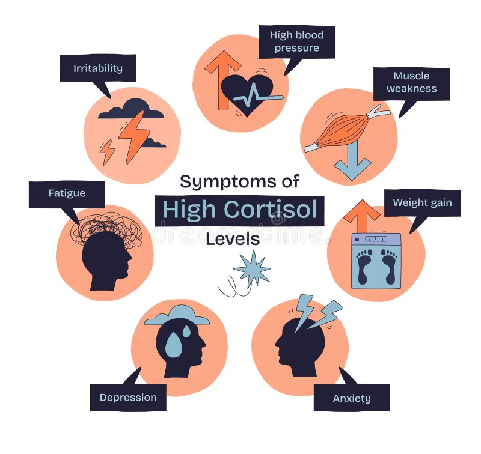
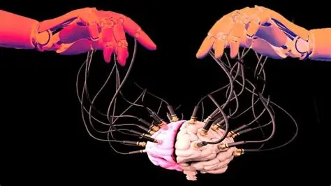

# Chapter One: Mental Health and Cognitive Function

&nbsp;&nbsp;&nbsp;&nbsp; A main problem associated with internet use is the effects on mental health. Today, the access to the internet in developed countries is unprecedented. It’s intertwined with daily functions from simple communication with loved ones to completing big projects for school or work. The internet itself is not the problem; how it is used and the frequency at which it is used are the concerns.

## *Internet Addiction*

{width=50%}

&nbsp;&nbsp;&nbsp;&nbsp; Increasing use of recreational technology like smartphones, at-home computers, and televisions has nurtured the presence of social media. Social media can be a place for self-expression; however, it harbors space for negative topics which is especially harmful for young, impressionable minds. 

&nbsp;&nbsp;&nbsp;&nbsp; For one, the internet, and particularly social media, have addictive features which can lead to overuse of technology. Internet use triggers the brain's reward centers causing the brain to release dopamine, or the "happy hormone", which reinforces extensive time online. The brain reacts to social media in similar ways as it does to substances, meaning brain activity is mirroring its activity during substance abuse (Morgan & Doe, 2025). These neurological pleasure reactions lead to people seeking out social media as a primary source of entertainment and diminishes the value of in person social interaction, physical activities, and hobbies all of which contribute to individual identity. Consuming social media as an easy way to unwind for a bit can quickly develop to an overreliance on social media for happiness.

## *General Cognitive Decline*

&nbsp;&nbsp;&nbsp;&nbsp; Overreliance is not strictly limited to social media but bleeds into other sectors of the internet, as well. Using the internet can provide a degree of ease to complete tasks that would require more effort manually. Humans are attracted to this effortlessness as our brain seeks out less work-intensive tasks as this was a biological adaptation to survive in prehistoric times. Although these behaviors can be acceptable to an extent for efficiency, using the internet for simple tasks can hurt our cognitive abilities. The brain can be compared to a muscle, and like a muscle, when it is worked less, it becomes weaker and loses some of its functionality. Neuroimaging has shown the area of the brain responsible for decision-making and cognitive control is changed with excessive internet use (Morgan & Doe, 2025). This part of the brain is also responsible for our memories that contain irreplaceable value in shaping who we are.

{width=50%}

&nbsp;&nbsp;&nbsp;&nbsp; Moreover, excessive internet use can lead to less sleep as eyes are fixed on entertaining screens rather than being shut. Low levels of sleep are associated with all sorts of physical and mental challenges. As time asleep is lost, cortisol levels are raised. Cortisol is commonly known as the "stress hormone", and in high levels, it can disrupt immune functions, metabolism, and mental performance. After little sleep, a person often experiences brain "fog" and inability to focus. 

&nbsp;&nbsp;&nbsp;&nbsp; This is only worsened by screens as they deplete our attention spans. Social media platforms force our brain to seek short, dopamine boosting content which compounds with distractions by screens while completing tasks. Research has suggested that people check their email on average 77 times a day (Mark, 2023). Notifications can serve as an extreme distraction while doing work and forces our attention to be spread across multiple tasks. When we frequently switch tasks, our body has a stress response and releases cortisol and raises our blood pressure (Mark, 2023). So, internet use is shrinking our attention spans, increasing our overall stress which hurts our general mental health. The streamline of these events is detrimental as poor mental health causes isolation whereby the social identity is impaired.

## *AI and Cognitive Decline*

{width=50%}

&nbsp;&nbsp;&nbsp;&nbsp; The decline of brain function is only regressing with the emergence of Artificial Intelligence (AI). A study conducted by MIT had a group of students complete a writing prompt. Some had access to AI, some had access to google search, and the others had their brain. The group using AI demonstrated little memory of what they wrote compared to the other groups when post study interviews were conducted (Hulscher, 2025). Additionally, the AI group’s neural activity was low even after the AI use was stopped, and they "showed a consistent decline in engagement, performance, and self-reported satisfaction." Therefore, frequent use of AI reinforces the brain to seek activities with lower neurological stimulation. The long-term outcomes of such neurological behavior cannot be entirely understood yet as AI is still in its infancy, but many researchers predict negative effects due to the "cognitive offloading" associated with AI use (Rossi et al., 2026).

## *The Internet and Mental Health Decline*

&nbsp;&nbsp;&nbsp;&nbsp; Aside from AI , problematic internet use alone can cause people to foster unhealthy headspaces. Research has unlocked insights that illustrate a negative cycle between internet use and happiness and hope. As internet use increases, happiness and hope decrease and then people seek out the internet as their source for happiness and hope (Yilmaz & Karaoglan Yilmaz, 2022). Moreover, people who have high internet use are more likely to exhibit depression symptoms and report feelings of loneliness (Morgan & Doe, 2025). This shouldn’t come as a surprise. Especially with social media, online activity welcomes comparison to one other, unsafe perception of body image, and synthetic relationships rather than personal connection. These effects contribute to the declining sense of shared global identity as division and isolation become more rooted in society.

## *Overview*

&nbsp;&nbsp;&nbsp;&nbsp; As these problems continue to develop, it is important to spread awareness about the harmful features of the internet and provide people with the skills to use the internet safely. Parents, in particular, need to understand how early exposure of the internet to the youth can affect their development and self-esteem. Not only can the way the internet is used be harmful, but the vulnerability to internet addiction is a rising problem.  Promoting safe internet use can help create a space where innovation and connection can bloom while interference with cognitive performance and mental health is reduced. Such action would help to realize significant improvements in SDG #3 (Good Health and Well-Being) as global mental health improves which also affects physical health. In addition, the integrity of global identity will be improved as individuals feel more connected to their own identity which is a result of good mental and physical health.

