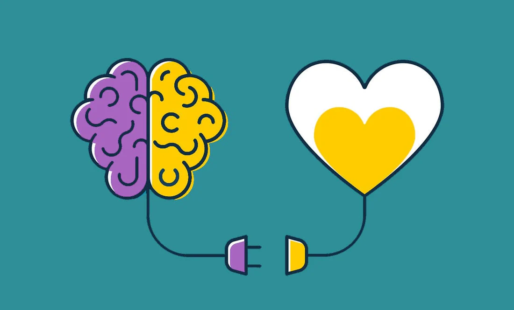

# Chapter Two: Physical Health 

{width=50%}

&nbsp;&nbsp;&nbsp;&nbsp; Mental health alone is a significant problem with internet use, but its effect on physical health makes its impact felt greater. The internet also directly affects physical health alone. In combination, improper use of the internet can be a means to a destructive lifestyle in terms of over health. So, to make progress on SDG #3, the origins of these impacts need to be traced and fully understood.

## *Social Interaction and Physical Health*

&nbsp;&nbsp;&nbsp;&nbsp; Social media and the internet can be detrimental to mental health which is a key factor in examining a person’s physical health. More time on the internet results in trading quality face-to-face connection for inauthentic online relationships, worsening one’s social identity. While social media and messaging apps can be a great way to stay in touch with long distance loved ones, it shouldn’t replace valuable in person relationships. But, oftentimes people fall into this pit as internet addiction develops and feelings of isolation increase. The quality of social interaction is an excellent predictor of mortality, and high-quality relationships have been shown to decrease all-cause mortality (Holt-Lunstad et al., 2010).

## *The Role of Physical Activity*

{width=50%}

&nbsp;&nbsp;&nbsp;&nbsp; Further, as people spend more time online feeding into superficial relationships and internet addiction, their overall physical activity decreases significantly. The two leading causes of death in the United States are stroke and cardiovascular disease (CVD), and getting 150 minutes of medium-difficulty activity a week can reduce risk for these diseases (CDC, 2025). The chance for getting type 2 diabetes and some cancers can be minimized by regular physical activity, as well. 

&nbsp;&nbsp;&nbsp;&nbsp; Physical activity has a tie to mental health and cognitive function. Research has illustrated that routine physical activity can improve brain function and happiness levels while limiting feelings of anxiety. Therefore, a cycle between physical health and mental health can be established, meaning that as internet addiction grows, a dangerous spiral in overall well-being begins to occur. When people fall into this cycle, they lose many of the relationships and hobbies that made them happy, resulting in an identity crisis.

## *Solutions*

&nbsp;&nbsp;&nbsp;&nbsp; The tandem between physical health and mental health is substantially impacted by the amount of internet use. But, there are simple solutions that everyone can make to achieve healthier internet activity that would likely ensue improvements for SDG #3. It can start by simply applying the "grayscale" to smartphones which turns off color on devices. This can help interrupt the dopamine reward system that many app designers employ to keep users engaged (Jarvis, 2026). Other ways to build better internet habits include setting screen time to non-essential apps and turning notifications off for these apps while designating a few times throughout the day to check them.

## *Overview*

&nbsp;&nbsp;&nbsp;&nbsp; Undertaking offline activities and hobbies help to resist the urge for internet use and simultaneously boosts physical and mental health. Although addressing this challenge can be daunting, approaching it with family or friends can make it easier and is a great way to incorporate an accountability system. Widespread decreased internet usage will foster stronger communities that can work towards a better future and upholding a unified identity as humans.

