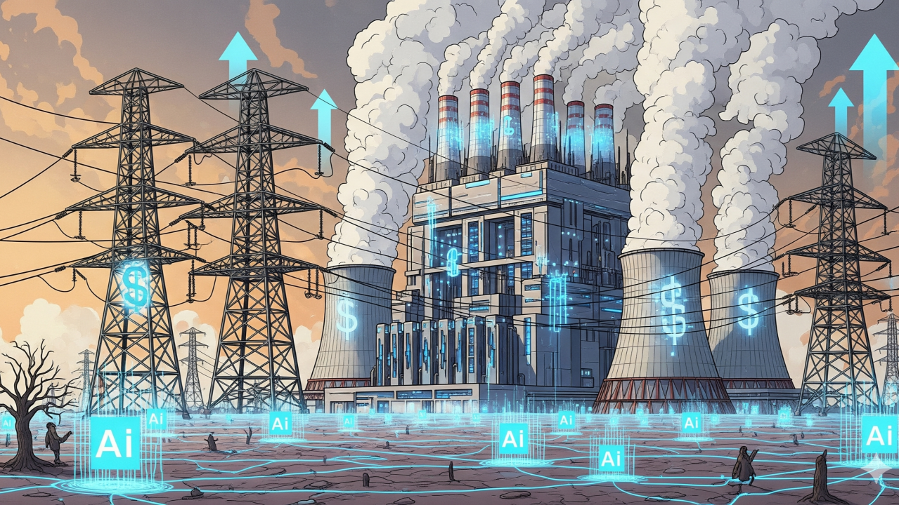

# Chapter Three:The Environment

&nbsp;&nbsp;&nbsp;&nbsp; As technological devices become more prominent and integrated into daily routines, their carbon footprint expands. Climate change is actively damaging Earth, the home of humanity and the human identity.

## *Device Manufacturing*

{width=50%}

&nbsp;&nbsp;&nbsp;&nbsp; The use of smartphones and the internet themselves are costly to the environment, but the resources to produce and maintain the function of these devices further this toll. Electricity grids are used to power and cool at-home devices, and these grids generate energy mainly through fossil fuels like coal and natural gas (Climate Impact Partners, 2021). The minerals needed to build these devices are frequently obtained through high emissions practices. Such minerals are chiefly found in regions in which workers are exploited, raising ethical concerns for technology manufacturing, as well.
 
## *Using Devices*

&nbsp;&nbsp;&nbsp;&nbsp; The harm to the environment by constructing these devices are compounded by the carbon footprint of their daily functions. For example, 1.76 grams of carbon dioxide is emitted from every web browser input, and each email sent emits 4 grams of carbon dioxide (Climate Impact Partners, 2021). The carbon footprint of emails can go up with attachments that can release up to 50 grams of carbon dioxide into the atmosphere. Not to mention, the rising popularity of social media is surging the carbon footprint of these apps. 

## *The Effects of AI*

{width=50%}

&nbsp;&nbsp;&nbsp;&nbsp; Climate change impacts are not constrained to the devices and apps themselves. They have seeped into the new developments of AI. Training large AI models requires a significant amount of carbon and energy, typically from non-renewable sources. Once these models are released to the public, every prompt has a small carbon footprint (Climate Impact Partners, 2025). However, the footprint is not so small considering the amount of users and prompts for AI on a day-to-day basis. The same principle applies for the water needed to produce an AI response. 

## *Solutions*

&nbsp;&nbsp;&nbsp;&nbsp; Nowadays, AI is built into many apps ranging from social media to music streaming services, making the challenge of reducing unnecessary AI use more complicated. Individual efforts to combat these problems can start by turning off AI features for web-browsers, but more meaningful change can be realized by spreading awareness about how AI cripples the environment. Increased awareness about the danger of AI to climate change will hopefully incentivize these companies to disclose the exact carbon costs of their models as well as encourage lawmakers to regulate AI production and consumption. 

## *Overview*

&nbsp;&nbsp;&nbsp;&nbsp; Opportunities to initiate change are everywhere for those who want to pioneer a sustainable future. And this sustainable future will become reality by adhering to the sub-targets of SDG #12 (Responsible Consumption and Production) and SDG #13 (Climate Action). Immediate action can begin by improving behavior surrounding internet and AI use which will contribute to saving our planet and improving overall health. As we move toward the future, pushing for a sustainable home that allows us to continue to explore our common human identity along with our individuality is so important.

