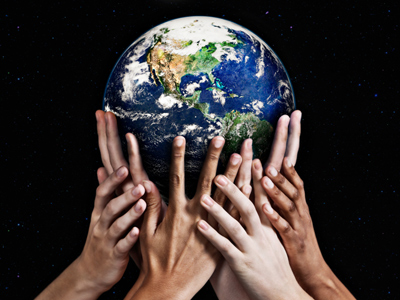

# The Outlook

{width=25%}

&nbsp;&nbsp;&nbsp;&nbsp; Evolution of technology has earned it a big place in our lives and in humanity. If used ethically, it could continue to have an exceptional impact on science and efficiency. However, the negative effects of excessive technology use on physical and mental health along with the environment is a warning that we must proceed with caution. The individual and global identities are being warped by unnecessary internet and AI use. Instrumental changes must be advanced now to repair individuality and unity in the human experience. This process has to begin with individual efforts that grow into large-scale movements for it to be effective. Although it can be intimidating, opportunities to ignite change are everywhere. The world is in our hands.
